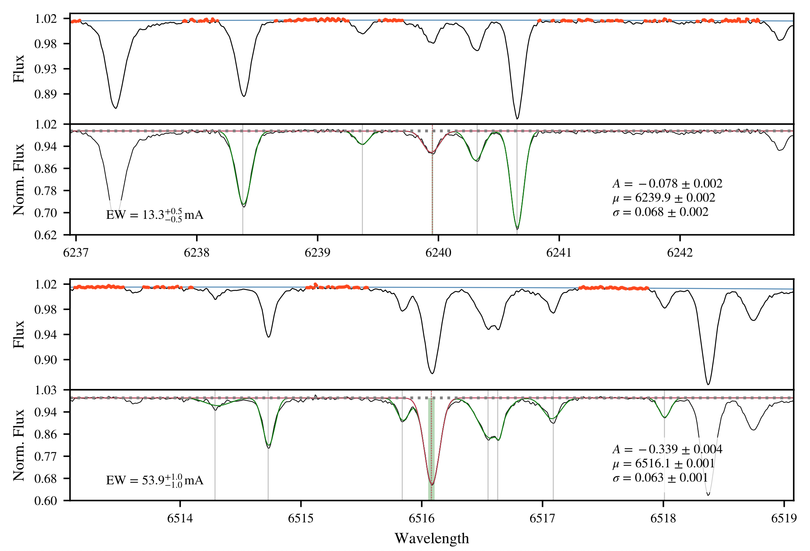

# EWComputation
Module that estimates the Equivalent Width (EW) for a list of stellar absorption lines, from high resolution echelle spectra. 

Uses regression methods to fit Gaussian-like profiles to the absorption lines, and outputs the distribution of EWs for every line (with a valid fit), based on the fit parameters and uncertainties.

For questions and/or suggestions (very welcomed!) please either pull an issue, or contact me at marisotov@gmail.com

If you're using this module in your research, please cite Soto et al. 2020 (https://arxiv.org/abs/2009.03371).

**Important**
The spectra has to be shifted to restframe before attempting to
compute the EWs, otherwise the lines won't be found.

## Usage:

Example:

```python
import numpy as np
from astropy.io import fits
from EWComputation import EW_calc

hdu = fits.open('sun01_harps_res.fits')
data = hdu[0].data
header = hdu[0].header

wave = data[0]
flux = data[1]
snr = header['SNR']

EW_calc('sun01_harps', wave, flux,
        linelist='linelist.dat', snr=snr, makeplot=True)
```

The plots created (if you use `makeplot=True) look like this:


